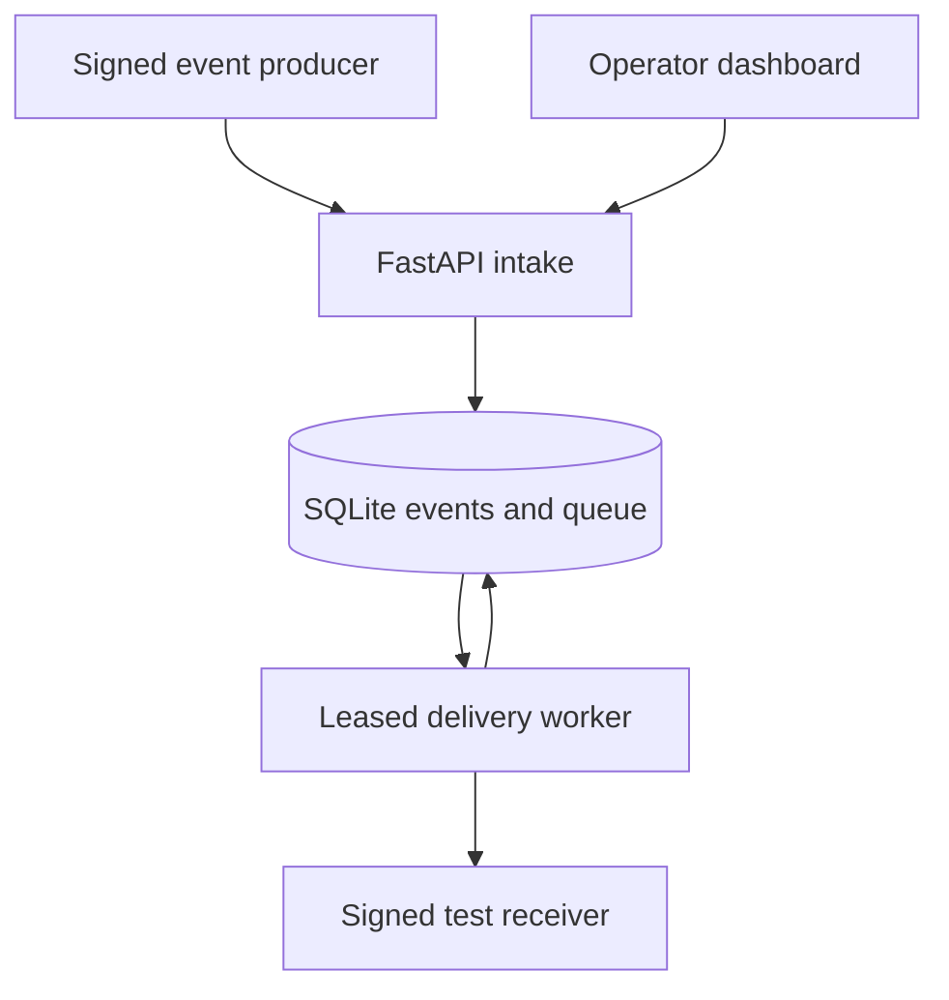

# RelayGuard

Reliable webhook delivery for small business integrations: persist an event, deliver it asynchronously, retry temporary outages, and investigate or replay failed deliveries.

**Version 0.2: working local reliability demo.** Signed intake, a delivery worker, bounded retries, durable attempt history, an authenticated operator dashboard and a failure simulator are implemented. PostgreSQL, React/TypeScript and public deployment remain later milestones. The dashboard currently uses dependency-free HTML/JavaScript served by FastAPI.

## Run on Windows in VS Code

Stop the old API terminal with **Ctrl+C** first. Extract this release into a new folder, then open the inner `relayguard` folder containing this README and `pyproject.toml`.

In a PowerShell terminal:

```powershell
py -m venv .venv
Set-ExecutionPolicy -Scope Process -ExecutionPolicy RemoteSigned
.\.venv\Scripts\Activate.ps1
python -m pip install -e ".[dev]"
python scripts/start.py
```

Python 3.12 or newer is required. If your environment is already created and activated, start from the install command. On Linux/macOS, activate with `source .venv/bin/activate` instead; omit the PowerShell execution-policy command.

The launcher starts API (8000), receiver (9000) and worker, generates separate secrets, sends a demo event twice, opens your browser and prints an **operator token**. Paste that token into the dashboard and press **Connect**.

Watch the event move from pending/delivering to delivered. The receiver returns 503 twice, then 200, typically within 6–10 seconds. Click **Details** to inspect all attempts. The duplicate submission has the same ID and does not create another event.

Keep the launcher terminal open. Press **Ctrl+C** to stop all services. The launcher generates a new operator token on each launch unless ADMIN_TOKEN is explicitly set. Database files persist under `data/`; the demo uses a new key each run so you always see a fresh delivery.

Dashboard: http://127.0.0.1:8000

API docs: http://127.0.0.1:8000/docs

## Demonstrate a failed delivery and replay

1. Stop the launcher with Ctrl+C.
2. Run `$env:RECEIVER_FAILURES = "99"` then `python scripts/start.py`.
3. Connect using the newly printed operator token. Wait roughly 35–40 seconds for five failed attempts, then inspect the failed event.
4. Stop the launcher. Set `$env:RECEIVER_FAILURES = "0"` and launch again.
5. Connect with the new token and click **Replay** on the previously failed event. It should deliver on the next poll. Details retain previous attempts and show a replay audit entry.

The receiver stores its call counts and deduplication state on disk. It applies each stable event ID once even if delivered repeatedly. A replay resets the worker's five-attempt budget, without deleting history.

## Upgrade from the starter

The easiest option is a fresh extraction of this release; keep the original folder as a backup. To preserve old intake events, stop all old/new services and copy the starter's `data/events.db` into the new `relayguard/data/` directory. If SQLite still has WAL/SHM files, copy the entire stopped `data/` folder, not just the database file. Back up that folder first. Existing pending events are automatically picked up by the worker. No existing event rows are deleted or rewritten during schema creation.

## Architecture



The stored event itself is the durable inbox. A pending event is sufficient for delivery: the worker backfills queue metadata transactionally. This avoids an intake database/broker dual write.

The worker uses short `BEGIN IMMEDIATE` transactions to claim one due event and assign a 30-second lease with a unique token. It commits before making the HTTP request. Completion is accepted only for the current unexpired token. Crashed workers are recovered after lease expiry. SQLite serialises writers; this implementation is for processes sharing a local database, not multiple machines.

## Delivery policy

- Success: HTTP 2xx.
- Retry: connection/transport errors, timeout, HTTP 408, 429 and 5xx.
- Terminal failure: other responses, including redirects (redirect following is disabled).
- Up to five claims per replay cycle, including claims lost to worker crashes.
- Delay: exponential backoff of 2, 4, 8 and 16 seconds, plus up to one second jitter.
- Numeric Retry-After is honoured up to 60 seconds; HTTP-date form is not implemented.
- Per-operation HTTP timeout: 5 seconds. Total request deadline: 10 seconds.
- One in-flight delivery per worker. Lease expiry can still cause overlapping remote effects; stable IDs must be deduplicated at the receiver.

**Delivery is at least once within a bounded retry policy, not exactly once.** A receiver can commit a business effect before the worker loses the acknowledgement. Our receiver stores its applied flag and event ID in one transaction to demonstrate idempotent effects. Exhausted events remain failed until explicitly replayed.

## API

`POST /v1/events`: JSON object up to 64 KiB. Headers:

| Header | Meaning |
| --- | --- |
| Idempotency-Key | 1–128 ASCII letters, numbers, underscores or hyphens |
| X-Timestamp | Unix seconds within 300 seconds of server clock |
| X-Signature | Lowercase hex HMAC-SHA256 of `timestamp + "." + key + "." + raw_body` |

Same key and exact body bytes return the existing receipt; changed bytes return 409. A 202 means stored, not delivered. The receipt status is the status observed when responding and may change immediately afterward.

The outgoing receiver signature uses the same format but substitutes the stable event UUID for the intake key. Separate `DELIVERY_SECRET` and `WEBHOOK_SECRET` avoid sharing producer and receiver credentials.

| Route | Purpose |
| --- | --- |
| GET / | Dashboard shell; contains no event data |
| GET /health/live | Process liveness |
| GET /health/ready | Database readability |
| GET /v1/operator/events | Latest 100 events |
| GET /v1/operator/events/{id} | Payload, attempts and replay history |
| POST /v1/operator/events/{id}/replay | Queue a failed event again; other states return 409 |

Operator routes require `Authorization: Bearer <ADMIN_TOKEN>`. The dashboard keeps the token only in page memory and uses textContent for untrusted payloads. It polls every two seconds. Its cards count the displayed latest 100 events, not lifetime totals.

## Configuration and manual startup

The launcher generates secrets automatically. To run components separately, set the following in each relevant terminal:

| Variable | Used by | Default |
| --- | --- | --- |
| WEBHOOK_SECRET | API / producer | Required, minimum 32 characters |
| ADMIN_TOKEN | API / dashboard | Operator endpoints disabled if absent |
| DELIVERY_SECRET | Worker / receiver | Required, minimum 32 characters |
| DB_PATH | API / worker | data/events.db |
| DESTINATION_URL | Worker | http://127.0.0.1:9000/webhook |
| RECEIVER_DB_PATH | Receiver | data/receiver.db |
| RECEIVER_FAILURES | Receiver | 2 per stable event ID |

```powershell
python -m uvicorn relayguard.api:app_factory --factory --host 127.0.0.1 --port 8000
# Separate terminal, same DB_PATH:
python -m relayguard.worker
# Separate terminal, same DELIVERY_SECRET:
python -m uvicorn relayguard.receiver:app_factory --factory --host 127.0.0.1 --port 9000
# Send a new event with the API's WEBHOOK_SECRET:
python scripts/demo.py
```

`.env.example` is a reference. Python does not load `.env` automatically. Docker Compose reads `.env`; the Python launcher reads current environment variables. For Docker, copy `.env.example` to `.env`, replace all three secrets, then run `docker compose up --build`. Docker configuration is supplied but not executed in the authoring environment.

## Validation

```powershell
python -m pytest -q
python -m ruff check .
python -m ruff format --check .
python -m mypy src
# Optional real HTTP check (uses ports 18000/19000):
python scripts/verify_http.py
```

25 tests cover intake, concurrency, persistence, retry scheduling, timeout, exhaustion, terminal 4xx, bounded Retry-After, crash recovery, stale completion, replay audits, operator authentication, receiver signature verification and durable deduplication.

Also verified over real HTTP: signed intake → duplicate receipt → receiver 503 → 503 → 200 → delivered. DOM-level dashboard checks passed for authentication headers, event listing, safe text rendering, details, replay and disconnect. Dashboard browser rendering has not been verified in the authoring environment because Chromium was unavailable. Ruff and strict mypy pass. The current Starlette test client emits an HTTPX deprecation warning; tests still pass. GitHub Actions is configured but hosted CI has not run until pushed.

## Repository structure

```text
.github/workflows/ci.yml
src/relayguard/
  api.py             # intake and operator API
  store.py           # event persistence
  queue.py           # job leases, attempts, replay audit
  worker.py          # signed delivery and retry policy
  receiver.py        # failing local receiver and idempotent effect
  dashboard.html     # authenticated operator interface
scripts/
  start.py           # one-command local launcher
  demo.py            # signed event and duplicate demo
  verify_http.py     # disposable live HTTP integration test
tests/
  test_intake.py
  test_delivery.py
docs/
  BUILD_PLAN.md
  DESIGN_DECISIONS.md
Dockerfile
compose.yaml
pyproject.toml
.env.example
```

## Scope and future work

Local portfolio demo; do not use real customer payloads. Public hosting requires operator identity/roles, TLS, rate limiting, retention and ingress timeouts. The receiver is a simulator, not a payment integration. Destination URLs are trusted operator configuration, never supplied by webhook callers; HTTPS is required except for named local demo hosts, and redirects/proxy environment settings are disabled. This is not a full SSRF policy for arbitrary tenant-controlled destinations.

Next engineering milestones: PostgreSQL with migrations and SKIP LOCKED claims, actual PostgreSQL integration tests, React/TypeScript UI, pagination, metrics, measured load tests and deployment. Current schema evolution is additive CREATE TABLE, not a migration framework. There is no transitive lock file or performance claim. Keep receiver-deduplication and fault tests when moving storage.

See [design decisions](docs/DESIGN_DECISIONS.md) and [build plan and interview questions](docs/BUILD_PLAN.md).
